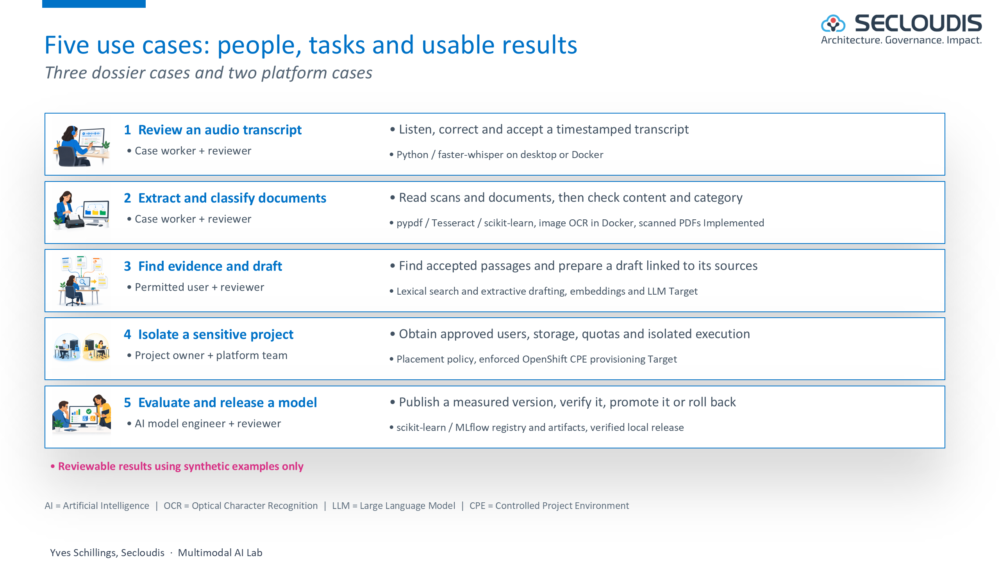
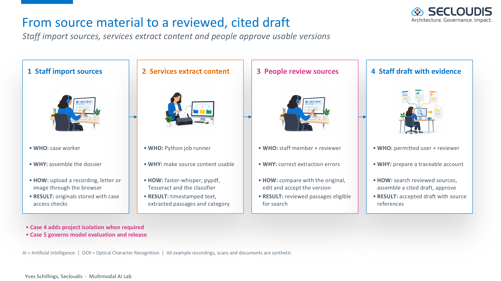
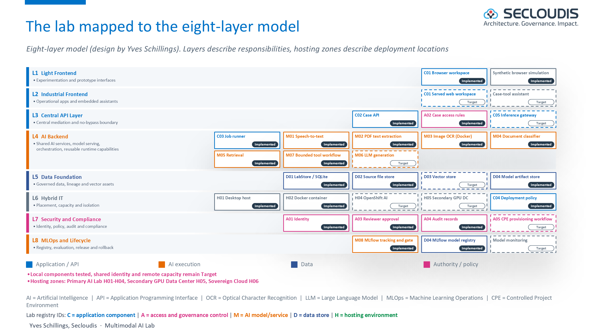
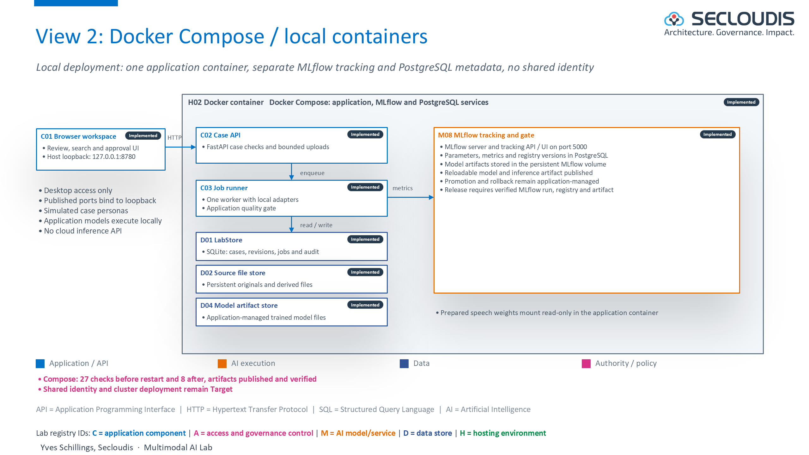
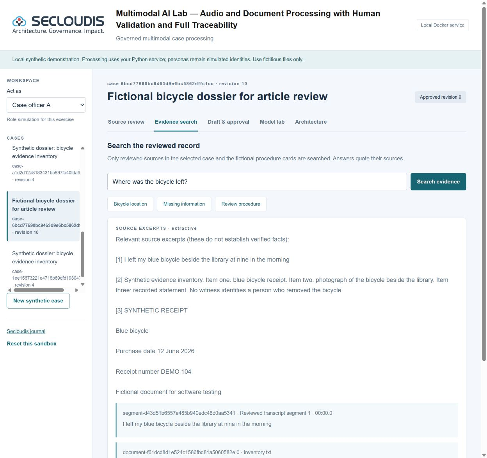
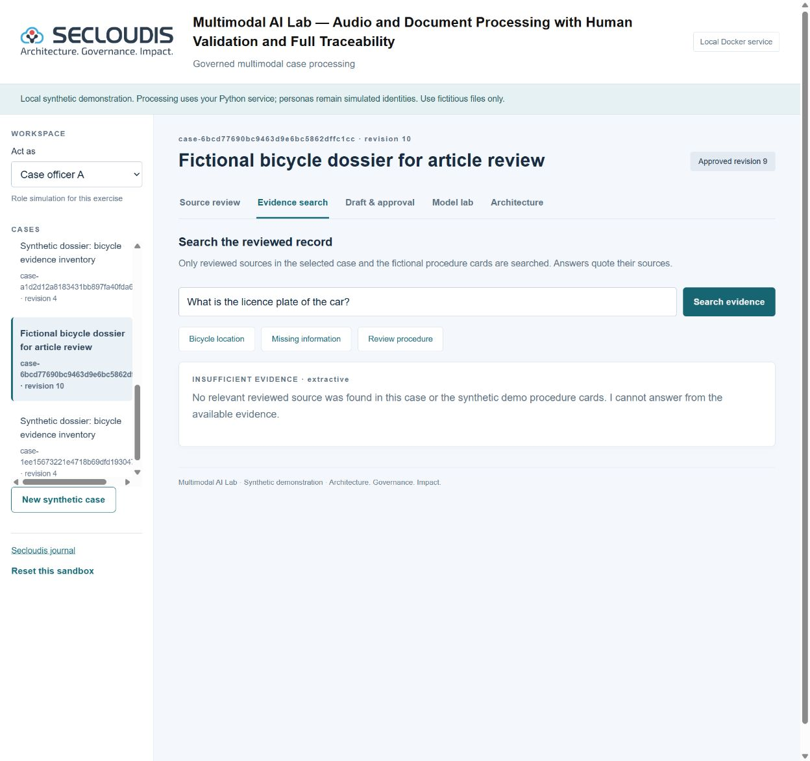
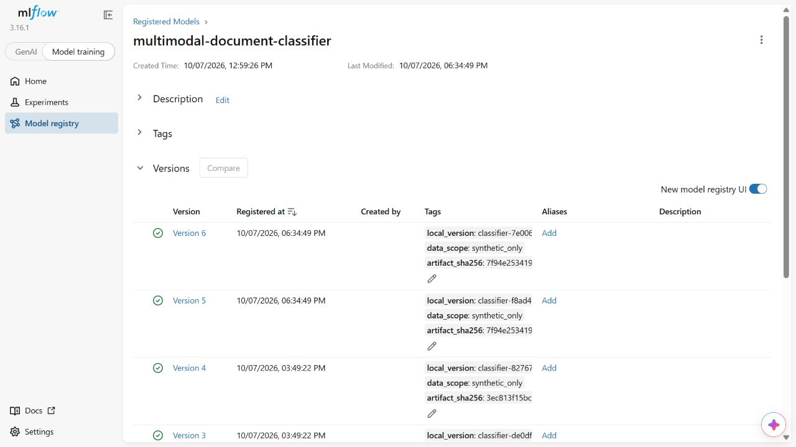

# Multimodal AI Lab

## Licence

The software source code, tests and deployment scripts are distributed under [Apache-2.0](LICENSE), including commercial use. See [NOTICE](NOTICE) for scope and attribution. The Secloudis logo, article text and architecture figures are excluded from this software licence. Third-party libraries and pretrained model weights retain their own licences.

A synthetic-data lab for document classification, speech transcription, reviewed-source search and human approval. The application connects a case workflow to measured model training and release decisions.

## Run locally

On Windows, double-click `Start.cmd`. The first launch creates `.venv` and installs the pinned dependencies. The application opens at **http://127.0.0.1:8770** and remains bound to loopback.

Alternatively, with Python 3.12:

```powershell
python -m venv .venv
.\.venv\Scripts\python.exe -m pip install -r requirements.txt
.\.venv\Scripts\python.exe -m uvicorn app:app --host 127.0.0.1 --port 8770
```

Choose a demo officer, review the synthetic transcript, search its reviewed sources and prepare a draft. Switch to the reviewer to approve it. Corrections invalidate the draft and its approval. The personas are explicitly simulated identities; they are not real authentication.

In **Model lab**, train a candidate. The sklearn TF-IDF/logistic regression pipeline uses 24 synthetic training samples and 8 held-out samples. MLflow stores metrics, a reloadable model and the exact inference artifact, then registers a model version. Reviewer promotion and rollback require a passing quality gate, a successful run, a ready registry version and matching published/local artifact checksums. Unavailable or incomplete evidence blocks release. The small synthetic evaluation does not establish production accuracy.

## Speech preparation

Speech recognition executes locally through faster-whisper. Model acquisition is a separate preparation step; application requests never download a model automatically:

```powershell
.\.venv\Scripts\python.exe scripts\prepare_speech.py
```

This downloads the public `base` model weights to the ignored `models/whisper-base` directory. Afterwards, import a synthetic recording of at most five minutes and 25 MiB. English, French and Dutch are supported by the adapter; actual quality depends on the recording and requires review.

## Run with Docker Compose

`deploy/docker/compose.yaml` starts the application, an MLflow tracking server and PostgreSQL (MLflow backend store) with persistent volumes, published on the host loopback only:

```bash
LAB_HOST_PORT=8780 docker compose -f deploy/docker/compose.yaml up -d --build
python scripts/demo_e2e.py --phase before --base http://127.0.0.1:8780
```

`scripts/demo_e2e.py` runs a synthetic dossier end to end (upload, review, draft, separate approval, question, denied access for another actor, training, promotion, rollback) and `--phase after` verifies that everything survived a restart. The case store remains SQLite on a volume; actors remain simulated identities. Details, verified results and limits: [docs/deployment.md](docs/deployment.md). OpenShift manifests are prepared, not tested: [deploy/openshift/README.md](deploy/openshift/README.md).

## Document input

Import UTF-8 TXT/MD/CSV or an unencrypted text PDF. The Docker image includes Tesseract for image OCR; desktop execution requires the executable separately. An image-only page in an unencrypted PDF is rendered with pypdfium2 and passed to Tesseract. Native PDF text is read first. Rendering size and OCR time are bounded. Uploaded source text, extraction and review remain separate.

## Browser-only synthetic demonstration

See the [Secloudis article](https://secloudis.com/ai-lab-multimodal-case-processing/), [code guide](docs/code-guide.md) and [deployment stages](docs/deployment.md). The [local OpenShift preparation guide](deploy/openshift/local.md) explains the distinction between OpenShift Local and the complete OpenShift AI platform.

`public-demo/` contains a separate, self-contained browser application. It uses synthetic fixtures only, reviewed-source lexical search, an extractive draft and a browser Naive Bayes classifier trained on its own synthetic corpus. Its weak baseline intentionally fails the release gate. Browser experiment state stays in the tab. This source directory does not establish a hosted public demonstration URL.

The browser-only demonstration has no live speech or LLM inference, server-side authentication, case uploads or MLflow server. These limits are visible in the interface. The local Python implementation provides file processing and separate sklearn/MLflow evidence. Neither version claims to be an official institutional system.

## Architecture and implementation status

See [component register](docs/components.md), [the eight-layer responsibility model](docs/ai-layers.md) (design by Yves Schillings) and [architecture](docs/architecture.md). The case store uses SQLite and one durable worker. MLflow's PostgreSQL backend and model artifact publication run in Compose. A PostgreSQL case store, pgvector, distributed messaging, trusted identity, generative RAG and OpenShift AI deployment remain extensions.

### Architecture figures for review

These figures connect the business use cases to software and hosting. Illustration artwork is conceptual; component status labels distinguish local implementation from planned shared deployment.










All examples are fictional. Real recordings or case documents require an explicitly authorised environment. Azure is a later option; transfer of real data requires explicit authorisation before activation.

## Tests

```powershell
.\.venv\Scripts\python.exe -m pytest tests -q
node tests/browser_core.test.mjs
```

The Python tests cover case isolation, stale revisions, human review, approval separation, bounded input, durable-job behaviour and model gates. The browser checks cover classifier gates, reviewed-source eligibility and insufficient evidence.

Source files and technical documentation belong in this repository. Presentation decks, article drafts, private source material, recordings, model weights, runtime databases and credentials do not.

## Synthetic workflow captures

These captures show the actual local Compose application with a fictional bicycle dossier.







## Dated verification package

[7 October 2026 closing evidence](docs/evidence/2026-10-07-closing/README.md) records 63 Python tests plus 15 subtests, 27 Compose checks before restart and 8 afterwards, real scanned-PDF OCR, model publication and source-approval invalidation. It also retains the container vulnerability findings. The prepared GitHub workflow has not yet run on GitHub. No green hosted-CI result or release tag is claimed.

[](https://github.com/yves-schillings/multimodal-ai-lab/actions/workflows/ci.yml)

The badge reports the hosted workflow status after publication. The retained image scan reports 76 HIGH and 1 CRITICAL package findings without a reported fixed version. The current workflow keeps the complete report and blocks on fixable HIGH/CRITICAL findings; zero fixable findings in that retained report does not establish a green hosted run or approve residual risk. See the [finding disposition and required follow-up](docs/evidence/2026-10-07-security-review/README.md). Representative human French and Dutch speech, clean-machine reproduction and cluster deployment still require their own acceptance runs.

## French and Dutch fixture results

The actual Whisper base adapter was measured on ten fictional machine-generated clips per language, with networking disabled. French WER was 67.11% and Dutch WER 71.01%. These high errors are a measured limitation on the formant-generated fixture set, not a representative human-speech score. See the [method, exact results and reproduction command](docs/speech-evaluation.md). Human recordings and broader acoustic conditions still require evaluation.

## Fresh local clone verification

The [7 October 2026 fresh-clone evidence](docs/evidence/2026-10-07-fresh-clone/README.md) records a separate clone of the unpublished snapshot, a new virtual environment and new Compose volumes. It passed 63 tests plus 15 subtests, browser core checks, 27 checks before restart and 8 afterwards, and image/scanned-PDF OCR as an arbitrary non-root UID with no network. Local cloning, dependency installation and tests took 108.49 seconds; model preparation, Compose build/start, restart and portability checks took another 157.47 seconds. These are same-workstation results with warm caches, not cold-cache startup, a clean-machine run, hosted CI or OpenShift acceptance.
