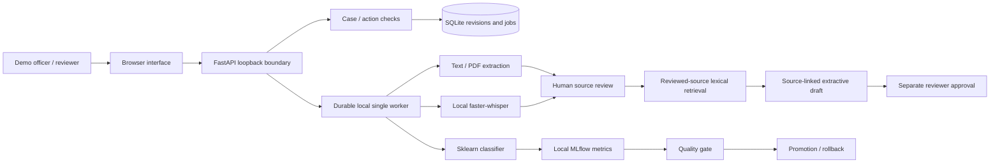
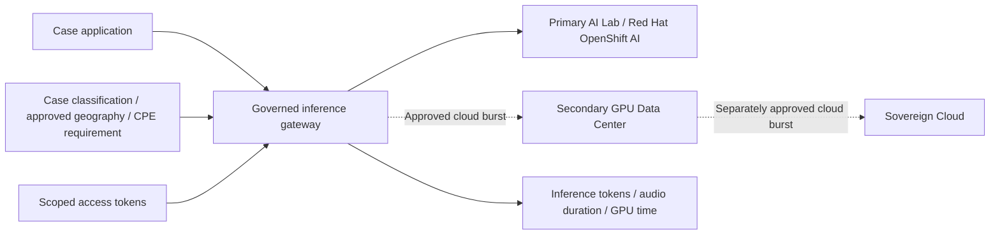

# Multimodal case processing architecture

**Current local extension, 9 October 2026:** offline pgvector/BGE-M3/Qwen3 RAG, local password sessions, two isolated AI CPEs, recurring MLflow classifier evaluation and selected Jupyter/KServe/native CPU training components are now accepted on local OKD. See the [current implementation](deployment/local-implementation.md) and [extension evidence](evidence/2026-10-09-local-ai-extensions/README.md). The baseline/diagrams below retain their original hosting scope; organizational identity, shared production hosting and the complete OpenShift AI product remain separate work.

The lab joins an application workflow with AI model lifecycle evidence. Its first release uses synthetic data and makes deployment boundaries explicit.

## Current execution

- The local application binds to loopback and rejects remote clients, foreign hosts and cross-origin requests. A selected persona is a demo fixture, not authentication.
- Case access precedes retrieval, file processing and job metadata reads. Sources require review before draft or search use. Stale edits are rejected; relevant changes invalidate approval.
- SQLite records job state. One worker replays pending work after restart, with idempotent document/transcript insertion. This is not distributed broker infrastructure.
- The document classifier trains on a small synthetic corpus. The Compose MLflow server records numerical measurements, published artifacts and registry versions. Promotion and rollback remain application-controlled and require matching artifact checksums.
- Speech inference reads a prepared local model. No application request calls a public transcription API or downloads model weights.
- The browser sandbox implements its own synthetic review/search/classifier exercise without a server. Its role switching is a simulation and does not prove production access control.

## Target architecture

For a shared private deployment, replace simulated identities with trusted OpenID Connect identity and enforce case permissions in the data layer and every tool. Introduce PostgreSQL with pgvector only after a measured embedding-retrieval comparison. Use controlled object storage for original files and a durable broker/outbox for distributed processing.

Add locally served language models and bounded tools only after evaluating grounding, abstention and prompt-injection behaviour. Treat source text as data, not authority to grant access. Preserve source/model/index/configuration versions and recheck access before returning evidence.

The target requires TLS, encryption at rest, managed secrets, least-privilege service identities, bounded resources, default-deny egress, retention/deletion and restricted audit access. Default logs/traces must not contain raw recordings, prompts, transcripts or drafts.

Docker and Kubernetes provide reproducible deployment and operational recovery evidence. Model rollback and application rollback are separate tests; database/index compatibility remains relevant.

Red Hat OpenShift AI is the selected deployment target for the AI Lab; its installation is not claimed by this local release. Azure is a later deployment option using synthetic data first. Real case data can enter Azure only after explicit authorisation and approved data-residency, access and retention controls.

## Release evidence

Acceptance requires a complete synthetic case, denied access, unsupported question abstention, source correction/approval invalidation, measured candidate evaluation, refused release and a verified rollback. A diagram or manifest alone does not establish a running Kubernetes, OpenShift or Azure deployment.

## AI Lab first, then controlled capacity expansion

Start with the AI Lab and measured model services. A secondary GPU data center and Sovereign Cloud are future resource pools, not active integrations. GPU generations and available capacity must be confirmed with the resource owner. No protected operator or provider identity is published.

The extension is a service chain: **Primary AI Lab → Secondary GPU Data Center → Sovereign Cloud**. The primary lab calls the secondary data center's approved AI service. The secondary service either executes on its own GPU pool or, when onward processing is explicitly permitted, calls the sovereign-cloud service. There is no direct primary-lab-to-sovereign-cloud route in this design. The secondary service preserves the original case restrictions, evaluates its own onward-transfer policy and uses a separately scoped workload identity. Results return through the same service chain.

Classify every case and derived source before routing: synthetic, internal or restricted. A resource catalogue records permitted processing regions, data classes, model services and approval references. Geography means the permitted processing and storage locations; it is not a proxy for case sensitivity. Audio, transcripts, scans, extracted text, embeddings and logs inherit the source restrictions unless a reviewed transformation explicitly changes their classification.

Cloud bursting routes eligible jobs to an approved resource pool when capacity thresholds are reached. It is never an automatic fallback for sensitive data. Check destination approval, case permissions, processing region, model compatibility, retention, quotas and network policy first. A connection between two pools does not authorise onward transfer. If no eligible capacity remains, queue or refuse the job. The executable planning policy in `lab/deployment_policy.py` demonstrates fail-closed classification, geography, CPE and quota decisions; it does not establish a live cloud connector.

Separate short-lived, audience-bound access tokens from model input/output tokens used for consumption measurement. Enforce per-project/model quotas and record metadata without raw content. Speech and document processing also need duration, request and GPU-time limits; they are not universally measured in language-model tokens. Billing depends on an approved contract and is not inferred from model token counts.

A **Controlled Project Environment (CPE)** is a governed, isolated environment selected by the case risk and access requirements. It is not mandatory for every workload. Speech transcription can use an approved shared service without a dedicated CPE where the case policy permits it; confidentiality, access control, encryption, retention and routing rules still apply. Restricted projects can require separate namespaces, identities, storage, network policy, quotas and model endpoints. CPE activation includes approval, provisioning, configuration, tests and accountable ownership.

Sovereign Cloud is an architectural resource category. Sovereignty and eligibility require validation of the exact service, region, contract, operational controls and applicable certification. The label alone never authorises a dataset transfer. Azure remains a separate later preparation with explicit authorisation for real data.
