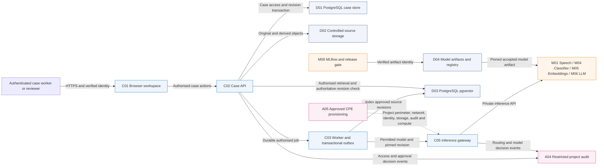

# Multimodal AI Lab architecture for on-premises deployment on Red Hat OpenShift AI

Version 1.0. Inventory reviewed on 7 October 2026.

The enterprise system supports five business capabilities: reviewed audio transcription, document extraction and classification, evidence-based drafting, controlled project isolation, and measured model release. The implementation backlog covers all of them, including vector retrieval. The existing eight-layer responsibility model remains the organising view, without an authorship or ownership claim. This document adds an implementation view without replacing the presentation's diagrams.

## Observed deployment and available products

The local Docker deployment has three healthy services: the application, MLflow and PostgreSQL. The application is exposed on host loopback port 8780, MLflow on loopback port 5000, and PostgreSQL has no published host port. Case metadata remains in SQLite. PostgreSQL stores MLflow experiment and registry metadata. No vector store or generative language model is implemented.

No current Kubernetes context or named contexts were configured during the inspection. `oc` and `crc` were not found on PATH. OpenShift application manifests exist, but no OpenShift or OpenShift AI installation or deployment has been verified. This observation concerns the accessible workstation and repository. It does not establish whether an unrelated organisational cluster exists.

An installed product, an enabled Operator component, a configured application service and an accepted business capability are four different inventory entries. Obtain the actual cluster inventory before marking any shared component installed.

| Scope | Observed baseline | Product capability | Remaining configuration |
| --- | --- | --- | --- |
| **Application** | > Local browser and FastAPI > Single durable worker > Simulated users | > Custom application deployed in containers | > Trusted login and case policy > Shared database and durable concurrent jobs > Secure ingress |
| **OpenShift Container Platform** | > Manifests prepared > No accessible cluster configured | > Projects, workloads, services and policy APIs after installation | > Supported cluster release > Storage and registry > Identity, certificates and network rules |
| **OpenShift AI** | > No installation confirmed | > Model-serving and development components enabled through the Operator | > Selected supported release and enabled components > Compatible runtime and prepared model > Project access and private endpoint |
| **Data services** | > SQLite cases > Local source files > PostgreSQL for MLflow | > Database and storage products provisioned separately | > Case PostgreSQL > Controlled object storage > Separate pgvector service and versioned index |
| **Governance** | > Local review, case checks and audit > Planning policy tests | > Platform RBAC and workload policies plus custom application controls | > Trusted API identity > CPE lifecycle and consumption accounting > Live gateway enforcement |
| **Model lifecycle** | > Local classifier training, publication and checksum-based promotion/rollback | > Existing MLflow plus selected pipeline/serving integration | > Shared credentials and artifact access > Accepted model endpoints > Monitoring and recovery |

OpenShift AI installs and manages enabled AI components. It does not automatically implement the case API, the application's review policy or the complete CPE described here. MLflow and the proposed pgvector database have their own deployment and integration work. The chosen release must be checked against its support and runtime matrix. [Red Hat installation documentation](https://docs.redhat.com/en/documentation/red_hat_openshift_ai_self-managed/3.5/html-single/installing_and_uninstalling_openshift_ai_self-managed/index), [model deployment documentation](https://docs.redhat.com/en/documentation/red_hat_openshift_ai_self-managed/3.5/html/deploying_models/deploying_models).

## On-premises deployment boundary

On-premises specifies the intended organisational hosting location. OpenShift AI Self-Managed can also run in cloud environments, so the product name alone does not establish an on-site deployment. The baseline design keeps case data, model execution and project controls on organisational infrastructure. Separately approved remote extensions retain their own routing and acceptance conditions.

The additional presentation views distinguish platform capabilities, application-to-data/model flows and the six CPE configuration elements. They supplement the preserved original diagrams. The article explains the same configuration responsibilities for every business use case. The platform's actual installed versions and enabled components must be inventoried before marking any of these shared services installed.

Some documented releases also integrate optional retrieval-augmented generation components. Evaluate their support and enabled state when selecting the release. Availability does not establish this application's case-specific index, reviewed-source lifecycle or authorization controls. The proposed pgvector service remains an explicit implementation choice to validate, rather than a claim that OpenShift AI lacks all retrieval capabilities.

## Business, information and application responsibilities

- **Case worker:** imports fictional or authorised sources, checks extraction and corrects source revisions.
- **Reviewer:** accepts source revisions and independently approves a cited draft or eligible model release.
- **AI model engineer:** selects pretrained models, trains the document classifier, measures quality and prepares immutable artifacts.
- **Project owner:** requests isolation, identifies approved people/data/models and remains accountable for environment scope and expiry.
- **Platform and security teams:** configure deployment, identities, data boundaries, policy enforcement and operational controls.

An original recording or document remains immutable and hash-addressed. Extraction produces a separate derived version. Human review establishes an eligible revision. Chunks and vectors inherit the same project, case, classification and revision. A draft identifies the exact supporting passages. Editing or revoking a source invalidates dependent approval and immediately makes stale passages ineligible. Model training and releases have separate dataset, run, artifact and reviewer lineage.

Database migrations, object uploads, vector indexing and model publication do not share one distributed transaction. Durable events, idempotency and authoritative revision checks are required. An index outage or delayed deletion must never allow an obsolete passage to support an answer.

## Proposed shared topology

This is an additional implementation view. Nodes below describe the proposed shared deployment, not an observed installation. C means application component, A access/governance control, M AI model or service, D data store and H hosting environment.

The API authorises case access before submitting work or searching. Workers recheck access when executing delayed jobs. The gateway applies the permitted-model catalogue and routing/consumption policy before dispatch. Model endpoints are private and cannot be called around the gateway by ordinary application users. Review and draft approval remain application business controls.

D01 is the authoritative case database. D03 is a derived retrieval index. The existing PostgreSQL service for MLflow is a third, separate metadata purpose. The proposed D03 starts as a separate service/database with its own credentials and backup policy. It does not turn MLflow's database into the case store. These stores can share a managed database platform only after explicit logical isolation, least-privilege and operational acceptance.

Vector retrieval can use a pretrained multilingual embedding model without adding a generative language model. Keep lexical retrieval as the measured baseline. Evaluate hybrid search on supported, paraphrased, unsupported, cross-case and revoked-source questions. Similarity alone cannot establish whether a passage contains the requested fact. [pgvector documentation](https://github.com/pgvector/pgvector).

## Eight-layer mapping to implementation

| Layer | Business responsibility | Deployment work |
| --- | --- | --- |
| **L1 Light Frontend** | > Experiment and review | > Retain local C01 workflow and reproducible demo |
| **L2 Industrial Frontend** | > Shared operational user interface | > Trusted login and accessible UI > Controlled shared ingress |
| **L3 Central API Layer** | > Mediate authorised requests | > C02 access and service contracts > C04 policy enforced by C05 gateway |
| **L4 AI Backend** | > Process audio/documents and produce supported drafts | > Durable workers > Evaluated models and private serving > Bounded retrieval/generation |
| **L5 Data Foundation** | > Preserve sources, versions and artifacts | > Case PostgreSQL and object storage > pgvector derived index > Restore and retention |
| **L6 Hybrid IT** | > Place work on approved resources | > OpenShift infrastructure and AI services > CPE quotas and scheduling > Separately approved hosting extensions |
| **L7 Security and Compliance** | > Control access, approval and accountability | > Identity and case policy > Six CPE elements > Routing, audit and expiry |
| **L8 MLOps and Lifecycle** | > Evaluate, publish, promote and restore models | > MLflow release evidence > Pipeline/serving integration > Monitoring and rollback |

## Model, library and runtime distinctions

- **M01:** pretrained Whisper weights perform speech recognition. faster-whisper executes those weights. PyAV decodes audio. CPU int8 describes execution hardware and numeric precision. These are not four separate models.
- **M02/M03:** PDF extraction and OCR adapters wrap libraries and an OCR engine. Their registry identifiers describe processing services.
- **M04:** the application trains a TF-IDF/logistic-regression classifier on its own dataset. The existing synthetic dataset is too small to establish representative quality.
- **M05:** retrieval is currently lexical. A pretrained embedding model is an additional candidate to evaluate and version for D03. Fine-tuning is not an assumed prerequisite.
- **M06:** a licensed pretrained language model and serving runtime remain to be selected. A compatible model server does not establish factual support or review approval.
- **M07/M08:** workflow orchestration and release tracking/gates are services, not independent pretrained models.

## Isolation and CPE boundary

A Controlled Project Environment (CPE) is a project-specific composition of six control families: Namespace, Network policy, Identity & policy, Storage scope, Audit & evidence, and Resource & compute. Secrets, rotation and revocation are explicit identity controls. Approved private model endpoints also require permitted network paths, scoped identities, pinned artifact integrity and compute budgets. Enforced routing and approved activation/expiry apply across the six families. The five lifecycle stages are request, approve, provision, verify, activate/operate; these are lifecycle steps rather than extra control families.

The project boundary includes source files, case metadata, derived vectors, credentials and model access. A namespace name alone does not prove isolation. Evaluate whether shared physical services with scoped roles/policies satisfy the case risk. Where they do not, provision dedicated data/model resources or a stronger hosting boundary. Privileged platform administrators remain a separate trust consideration. Cluster RBAC does not replace case-level application authorization.

The [deployment guide](../deploy/system/README.md#controlled-project-environment-configuration-for-docker-and-openshift) specifies each element, its observed baseline, configuration and negative tests. No CPE is presently activated by the local application.

## Operations and external services

Backups cover cases, original objects, index/model versions, registry metadata and audit. Restore needs a consistent revision watermark and may rebuild vectors from approved sources. Acceptance also covers permissions, credential rotation, load, failed jobs, model rollback, expiry and closure. Record recovery objectives after the workload and owner requirements are agreed.

Primary AI Lab may request separately approved AI services from the Secondary GPU Data Center. Only that secondary service may initiate independently approved onward processing to Sovereign Cloud. No direct primary-to-cloud path is permitted. An unavailable authorised service queues or refuses work. It does not silently choose another destination.

## Inventory and backlog linkage

The accompanying implementation workbook contains the full inventory of 28 registry components plus six platform capability entries. Each entry identifies its product/runtime, observed environment, existing evidence, remaining configuration and work-item IDs. The [60-item backlog](system-implementation-backlog.md) includes owner roles, prerequisites, acceptance and evidence. Draft S/M/L effort ranges, owner profiles, 15 activation gate priorities, 38 mandatory dependencies and architecture decision references are recorded. Named assignees, available capacity and deployment dates remain unconfirmed planning inputs.
